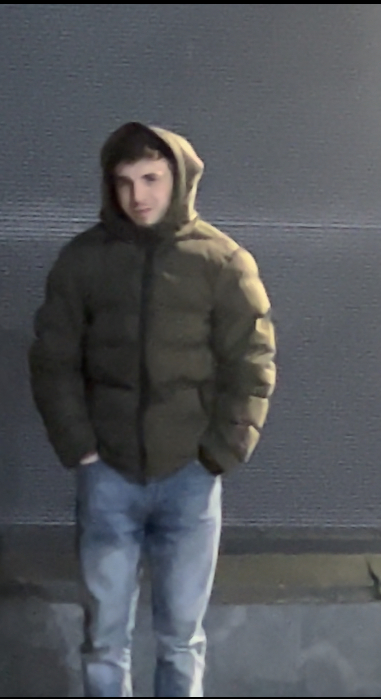

# Dnepr news
obeziana-osyp
<!DOCTYPE html>
<html lang="ru">
<head>
    <meta charset="UTF-8">
    <meta name="viewport" content="width=device-width, initial-scale=1.0">
    <title>Обезьяна Осыпь</title>
    
</head>
<body>

    <header>
        <h1>Обезьяна Осыпь: Загадочная Болезнь</h1>
    </header>

    

        <h2>Введение</h2>
        
Обезьяна осыпь — это редкая и загадочная болезнь, которая поражает как людей, так и обезьян. Она вызывает необычные симптомы и привлекла внимание ученых по всему миру.

        <h2>История</h2>
        
Болезнь была впервые обнаружена в маленьком поселении в тропических лесах Амазонки. Местные жители заметили, что после контакта с дикими обезьянами у них начинают появляться необычные высыпания на коже, напоминающие шерсть. Симптомы были похожи на аллергию, но также сопровождались резким изменением настроения и усилением любопытства.

        <h2>Симптомы</h2>
        <ul>
            <li>Высыпания на коже</li>
            <li>Увеличение активности</li>
            <li>Периоды спокойствия, чередующиеся с периодами беспокойства</li>
        </ul>

        <h2>Галерея Исследований</h2>
        

            
            
            
            
        

        <h2>Исследования</h2>
        
Учёные, заинтересованные в изучении этой болезни, провели множество исследований и обнаружили, что заболевание связано с воздействием определенных бактерий, обитающих в коже обезьян.

        <h2>Заключение</h2>
        
Обезьяна осыпь остается предметом интенсивных исследований, и ученые продолжают искать пути для понимания и лечения этой уникальной болезни.

    

    <footer>
        
&copy; 2024 Обезьяна Осыпь. Все права защищены.

    </footer>

</body>
</html>
<!DOCTYPE html>
<html lang="ru">
<head>
    <meta charset="UTF-8">
    <meta name="viewport" content="width=device-width, initial-scale=1.0">
    <title>Обезьяна Осыпь</title>
    
</head>
<body>

    <header>
        <h1>Обезьяна Осыпь: Загадочная Болезнь</h1>
    </header>

    

        <h2>Введение</h2>
        
Обезьяна осыпь — это редкая и загадочная болезнь, которая поражает как людей, так и обезьян. Она вызывает необычные симптомы и привлекла внимание ученых по всему миру.

        <h2>История</h2>
        
Болезнь была впервые обнаружена в маленьком поселении в тропических лесах Амазонки. Местные жители заметили, что после контакта с дикими обезьянами у них начинают появляться необычные высыпания на коже, напоминающие шерсть. Симптомы были похожи на аллергию, но также сопровождались резким изменением настроения и усилением любопытства.

        <h2>Симптомы</h2>
        <ul>
            <li>Высыпания на коже</li>
            <li>Увеличение активности</li>
            <li>Периоды спокойствия, чередующиеся с периодами беспокойства</li>
        </ul>

        <h2>Галерея Исследований</h2>
        

            <!-- Первый элемент галереи -->
            

                
                
Рост высыпаний на коже у пациента с обезьяной осыпью.

            

            <!-- Второй элемент галереи -->
            

                
                
Толстая обезьяна, демонстрирующая высыпания на коже.

            

            <!-- Третий элемент галереи -->
            

                
                
Гоблин с необычными признаками обезьяной осыпи.

            

            <!-- Четвертый элемент галереи -->
            

                
                
Егор и Эд с видимыми симптомами болезни на коже.

            

        

        <h2>Исследования</h2>
        
Учёные, заинтересованные в изучении этой болезни, провели множество исследований и обнаружили, что заболевание связано с воздействием определенных бактерий, обитающих в коже обезьян.

        <h2>Заключение</h2>
        
Обезьяна осыпь остается предметом интенсивных исследований, и ученые продолжают искать пути для понимания и лечения этой уникальной болезни.

    

    <footer>
        
&copy; 2024 Обезьяна Осыпь. Все права защищены.

    </footer>

</body>
</html>
Даимонд ИСАЕВ, [22.09.2024 01:39]
/your-website
│
├── /css
│   └── styles.css
│
├── /js
│   └── script.js
│
├── /images
│   └── (your image files here)
│
└── index.html
<!DOCTYPE html>
<html lang="en">
<head>
    <meta charset="UTF-8">
    <meta name="viewport" content="width=device-width, initial-scale=1.0">
    <title>The Disease of Dnipro</title>
    <link rel="stylesheet" href="css/styles.css">
</head>
<body>
    <header>
        
The Dnipro Plague

        <nav>
            <ul>
                <li><a href="#symptoms">Symptoms</a></li>
                <li><a href="#about">About</a></li>
                <li><a href="#gallery">Gallery</a></li>
                <li><a href="#contact">Contact</a></li>
            </ul>
        </nav>
    </header>

    <section id="hero">
        <h1>The Dnipro Plague</h1>
        
A deadly disease taking over the city of Dnipro. Beware of the strange symptoms!

    </section>

    <section id="symptoms">
        <h2>Symptoms</h2>
        <ul>
            <li>Anal tooth cancer</li>
            <li>Extreme acne breakouts</li>
            <li>Rapid hair loss (including in unexpected areas)</li>
            <li>Sudden vomiting of earwax</li>
            <li>Uncontrolled eyebrow twitching</li>
            <li>Loss of sense of humor</li>
        </ul>
    </section>

    <section id="about">
        <h2>About the Disease</h2>
        
The Dnipro Plague started in 2024, infecting hundreds of residents. Scientists have discovered that this virus spreads through an unusual strain of bacteria found in the city's water supply. It causes a series of bizarre and often embarrassing symptoms, which lead to severe social isolation for the infected. Current research is ongoing to find a cure, but the symptoms continue to evolve in strange ways.

    </section>

    <section id="gallery">
        <h2>Infected Gallery</h2>
        

            

                
            

            

                
            

            

                
            

            

                
            

        

    </section>

    <section id="contact">
        <h2>Contact Us</h2>
        
If you or someone you know shows symptoms, contact us immediately at <a href="mailto:help@dniprodisease.com">help@dniprodisease.com</a>.

    </section>

    <footer>
        
&copy; 2024 The Dnipro Plague. All rights reserved.

    </footer>

    

        &times;
        
    

    
</body>
</html>
* {
    margin: 0;
    padding: 0;
    box-sizing: border-box;
}

body {
    font-family: 'Arial', sans-serif;
    color: #333;
    background-color: #f4f4f4;
}

header {
    background-color: #232323;
    color: #fff;
    padding: 10px 0;
    text-align: center;
}

header .logo {
    font-size: 2rem;
}

nav ul {
    list-style: none;
    margin-top: 10px;
}

nav ul li {
    display: inline;
    margin: 0 20px;
}

nav ul li a {
    color: #fff;
    text-decoration: none;
}

#hero {
    text-align: center;
    background-color: #ff6f61;
    padding: 100px 20px;
    color: white;
}

#symptoms, #about, #gallery, #contact {
    padding: 40px 20px;
}

#gallery {
    text-align: center;
}

.gallery-container {
    display: flex;
    flex-wrap: wrap;
    justify-content: center;
}

.image-box {
    margin: 10px;
    overflow: hidden;
}

.gallery-img {
    width: 200px;
    height: 200px;
    object-fit: cover;
    cursor: pointer;
    transition: transform 0.3s ease;
}

.gallery-img:hover {
    transform: scale(1.1);
}

Даимонд ИСАЕВ, [22.09.2024 01:39]
footer {
    background-color: #232323;
    color: #fff;
    text-align: center;
    padding: 10px 0;
}

.modal {
    display: none;
    position: fixed;
    z-index: 1000;
    left: 0;
    top: 0;
    width: 100%;
    height: 100%;
    overflow: auto;
    background-color: rgba(0, 0, 0, 0.8);
}

.modal-content {
    margin: auto;
    display: block;
    max-width: 90%;
    max-height: 90%;
}

.close {
    position: absolute;
    top: 20px;
    right: 35px;
    color: #fff;
    font-size: 40px;
    font-weight: bold;
    cursor: pointer;
}

.close:hover,
.close:focus {
    color: #999;
    text-decoration: none;
    cursor: pointer;
}
// Modal functionality for enlarging images
const modal = document.getElementById('modal');
const modalImg = document.getElementById('modalImage');
const closeBtn = document.getElementsByClassName('close')[0];
const images = document.getElementsByClassName('gallery-img');

Array.from(images).forEach(image => {
    image.onclick = function() {
        modal.style.display = 'block';
        modalImg.src = this.src;
    }
});

closeBtn.onclick = function() {
    modal.style.display = 'none';
}

window.onclick = function(event) {
    if (event.target == modal) {
        modal.style.display = 'none';
    }
}
body {
    background-color: #000000; /* Чёрный фон */
    color: #ffffff; /* Белый текст */
}

header {
    background-color: #1a1a1a; /* Тёмный фон для заголовка */
}

nav ul li a {
    color: #ffffff; /* Белый цвет ссылок */
}

#hero {
    background-color: #333333; /* Тёмно-серый фон для секции hero */
}

footer {
    background-color: #1a1a1a; /* Тёмный фон для подвала */
    color: #ffffff;
}
